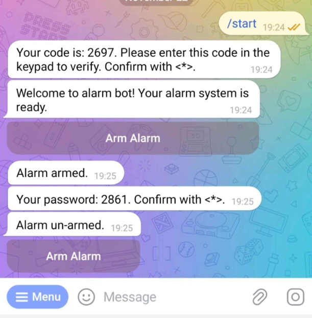

# Raspberry Pi Alarm System


## Description

This project is a smart alarm system for Raspberry Pi, featuring:
- Motion detection using a PIR sensor
- Keypad input for arming/disarming and user verification
- LCD display for real-time status updates
- Telegram bot integration for remote notifications and control
- Multi-user support with chat verification

The system is designed for home security and can be easily extended or customized.

## Project Images

### Hardware Setup

<p align="center">
  
  
  
</p>

### System Schema

<p align="center">
  
</p>

### Telegram Bot Interface

<p align="center">
  
  
  
</p>


## How to Use

1. **Install Required Packages**  
   See the next section for installation commands.

2. **Hardware Setup**  
   - Connect the keypad to GPIO pins (rows: 29, 31, 33, 35; cols: 32, 36, 38).
   - Connect the LCD display and PIR motion sensor (GPIO 14).
   - Enable I2C on your Raspberry Pi (see below).

3. **Configure Environment**  
   - Copy `.example.env` to `.env` and set your Telegram bot token.

4. **Run the System**  
   ```sh
   python run.py
   ```

5. **Control via Telegram**  
   - Start a chat with your bot and follow instructions to verify your chat.
   - Use the keypad to enter codes as prompted.

## Required Packages

To run this project, you need to install the following Python packages:

1. **RPi.GPIO**: This package is used to control the GPIO pins on the Raspberry Pi.
    ```sh
    pip install RPi.GPIO
    ```

2. **rpi_lcd**: This package is used to control the LCD display connected to the Raspberry Pi.
    ```sh
    pip install rpi_lcd
    ```

3. **telepot**: This package is used to send notifications via a bot.
    ```sh
    pip install telepot
    ```
4. **dotenv**: This package is used to load environment variables from a .env file.
    ```sh
    pip install python-dotenv
    ```
5. **gpiozero**: This package is used to control the motion sensor.
    ```sh
    pip install gpiozero
    ```

## Enabling I2C Interface

To enable the I2C interface on the Raspberry Pi, follow the steps below:

1. Run the following command to open the Raspberry Pi configuration tool:
    ```sh
    sudo raspi-config
    ```
2. Select `Interfacing Options` from the menu.
3. Select `I2C` from the list of interfaces.
4. Choose `Yes` when asked if you want to enable the I2C interface.
5. Reboot the Raspberry Pi to apply the changes.

## Setting Up the .env File

To use the Telegram bot in this project, you need to create a `.env` file in the project directory with contents as in .env.example file. Replace the placeholders with your actual values.

---

## License

This project is licensed under the MIT License. See the [LICENSE](LICENSE) file for details.